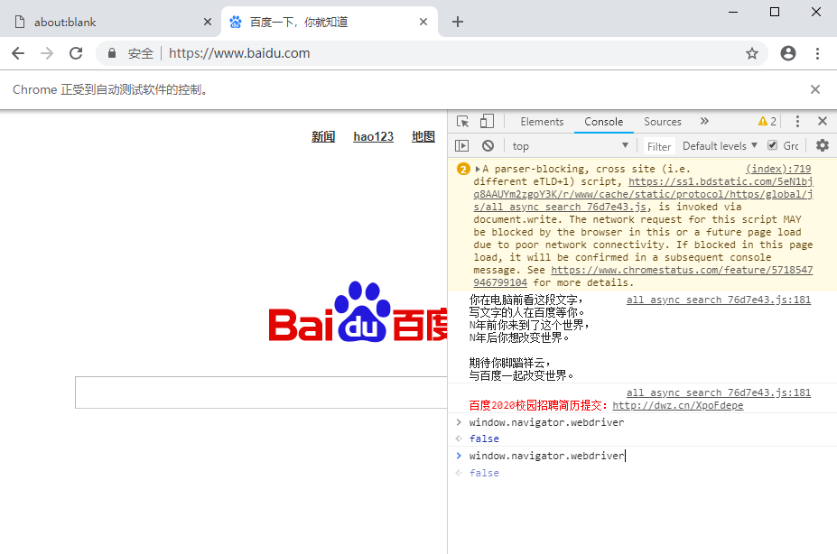

# pyppeteer
# 为啥用它
    我曾经用selenium + chrome 实现了模拟登陆这个电商平台，但是实在是有些麻烦，绕过对webdriver的检测不难，
    但是，通过webdriver对浏览器的每一步操作都会留下特殊的痕迹，会被平台识别，
    这个必须通过重新编译chrome的webdriver才能实现，麻烦得让人想哭。
    不说了，都是泪，所以直接用pyppeteer

    
# 安装环境
    环境要求 : Pyppeteer requires python 3.6+.
    pip install -i https://pypi.douban.com/simple pyppeteer
        

# 参考文档
    官方文档： https://miyakogi.github.io/pyppeteer/reference.html
    网络爬虫之使用pyppeteer替代selenium完美绕过webdriver检测 http://www.manongjc.com/detail/6-lkhaqtmnlofewjs.html
    
# 常见问题：
    1、运行pip install pyppeteer后 如报错： Command "python setup.py egg_info" failed with error code 1 in xxxx....
        则需要更新pip ,命令如下：
        python -m pip install --upgrade pip

    2、第一次运行代码时，会下载
        [W:pyppeteer.chromium_downloader] start chromium download.      
        Download may take a few minutes.  

